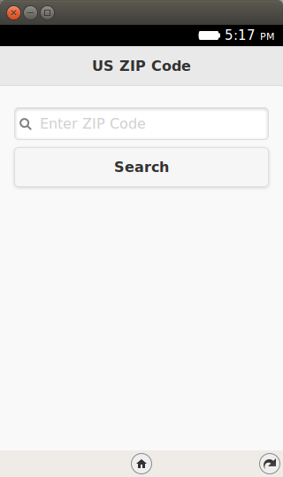
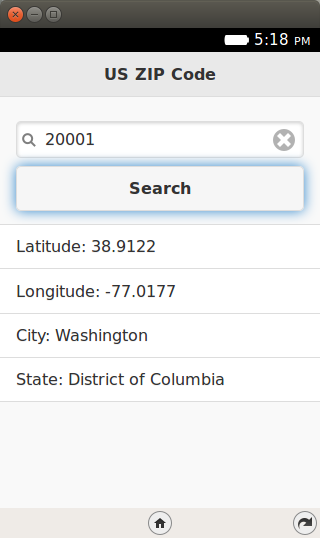

.. Copyright (C) Romin Irani. Permission is granted to copy, distribute
   and/or modify this document under the terms of the Creative Commons
   Attribution-ShareAlike 4.0 International Public License.

.. _hello_world:

Hello World
===========

Prerequisites
-------------

You have setup your machine with the Firefox OS Simulator. If not, you can go
back to :ref:`dev_setup` to do this.

.. index:: hosted apps, packaged apps, apps; hosted, apps; packaged

Brief Overview of Firefox OS Apps
---------------------------------

Firefox OS supports 2 kinds of applications: **Hosted Apps** and
**Packaged Apps**.

**Hosted Apps** are those that are hosted at a web url. All the files that
compose the app i.e. HTML, JS, CSS, images, etc are all present at the hosted
url itself. No file is present on the device and the device will need to be
connected to the internet to use it. There are mechanisms now in HTML5 like
AppCache that allow you to cache assets of the file locally though for most
purposes, we will assume that hosted apps are completely present online.

The advantage of hosted apps is that you can update them easily and all your
users will get the latest version immediately on next access. The flip side is
that they have to be connected.

**Packaged Apps** take the opposite approach. All the files that compose your
web app i.e. HTML, JS, CSS, images, etc are packaged into a ZIP file. The ZIP
file is downloaded on your device and the app is installed locally.
Applications that are deployed in this fashion can function without the device
being connected to the internet. However, if your application makes use of some
public API or external web service, you will need to be connected.

The Firefox Marketplace which we shall see in a later episode supports listing
of both Hosted and Packaged Applications.

Episode 2 in Action
-------------------

Let us check out the application in action first. This will help you understand
what we shall be achieving by the end of this blog post. While we follow
tradition and would like to say “Hello World”, it will be good to go a bit
beyond that.

What we shall write is a mobile application that will give us details on the
different Pincodes in India. Pincodes are similar to Zipcodes if you want an
analogy. You enter a valid Pincode in the application and it will give you the
details of that Pincode i.e. its State name, District Name, etc.

The mobile application makes use of an external Web service called `India
Pincodes <http://www.programmableweb.com/api/india-pincode>`__. This will also
help demonstrate making Ajax calls over the network from your Firefox OS
Mobile. Nothing special there but by taking a little more realistic example, it
will help set off things on the right note.

All right then, the first screen of the mobile app is shown below:

When we enter a valid pincode e.g. **110001**, the app makes a call to the
Pincode service and retrieves/parses/displays the information as shown below:

Simple and useful? Let’s get going with the code. Note that the example
screenshots are from the Firefox OS Simulator running locally.

Download Full Source Code – Episode 2
-------------------------------------

I suggest that you begin with a full download of the project source code. Since 
the project depends on libraries like jQuery and jQuery Mobile, it will save
you the hassle of downloading the dependent libraries.

Go ahead and download the code from:
`https://github.com/rominirani/IndiaPincodesApp
<https://github.com/rominirani/IndiaPincodesApp>`__

Extract all the code in some folder. For e.g. on my machine, the code is
present in e:\firefox-os-blog\episode2\IndiaPincodesApp but it could be any
directory of your choice. You should see a folder structure inside of
IndiaPincodesApp, that looks something like this:

.. image:: illustrations/episode02/folder_structure.png
   :alt: App folder structure 
   :height: 150px

You will notice that ``jQuery`` and ``jQueryMobile`` libraries are present but
the key files that make up your application are ``index.html`` and the
``manifest.webapp`` file that we shall discuss next.

The code – index.html
---------------------

Since our application is a simple single screen application, all we need at
this point is a single ``index.html`` file. The code for the same is shown
below:

.. sourcecode:: guess
    :linenos:

    <!DOCTYPE html> 
    <html>
 
    <head>
        <meta charset="utf-8">
        <meta name="viewport" content="width=device-width, initial-scale=1"> 
        <title>India Pincodes</title> 
        <link rel="stylesheet" href="jquery.mobile-1.3.1.min.css" />
        
        
        
</head> 
 
<body> 
 
<!-- Start of first page: #home -->

 
    

        <h3>India Pincodes</h3>  
    
<!-- /header -->
 
    

        <input type="search" id="searchCriteria" value="" placeholder="Enter Pincode" autofocus/>
        <a href="#" id="btnSearch" data-role="button">Search</a>
        
&nbsp;
        
        <ul data-role="listview" id="searchResults">
 
        </ul>           
 
    
<!-- /content -->

<!-- /page home -->
</body>
</html>
