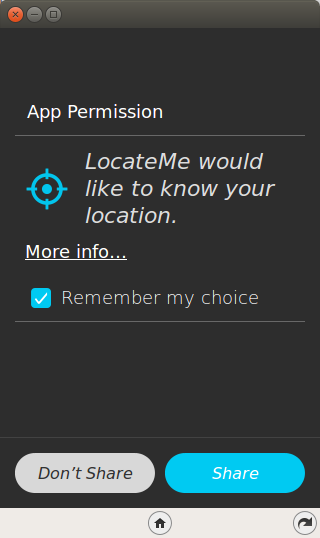

.. Copyright (C) Romin Irani. Permission is granted to copy, distribute
   and/or modify this document under the terms of the Creative Commons
   Attribution-ShareAlike 4.0 International Public License.

.. _locationlocation:

Location, Location, Location
============================

Welcome to Episode 5 of the Firefox OS App Development Tutorial. This episode
will take you through the steps for writing Firefox OS Apps that are location
aware. What this means is that your application can interact with the
`GPS receiver <http://en.wikipedia.org/wiki/GPS_navigation_device>`__
that is present on the Firefox OS Device, retrieve the current position
(`latitude <http://en.wikipedia.org/wiki/Latitude>`__, `longitude
<http://en.wikipedia.org/wiki/Longitude>`__) and thereby help you write
location based applications.

Prerequisites
-------------

* You have setup your machine with the Firefox OS Simulator.  If not you can
  check out :ref:`dev_setup`, which takes you through the entire setup.
* You have installed the ``zipcodeapp`` that we covered in :ref:`hello_world`.
  This tutorial uses that as an example, but if you have any other application
  installed in the Firefox WebIDE, then you should be able to follow along.

What this Episode covers 
------------------------

* What are Location Based Applications.
* HTML5 Geolocation API.
* Sample Firefox OS Application that covers using HTML5 Geolocation API.
* Sample Firefox OS Application that uses HTML5 Geolocation API to retrieve
  current position (latitude, longitude) and plot that on the Google Map. 

Episode 5 in Action
-------------------

Let's check out the application in action first. This will help you understand
what we shall be achieving by the end of this tutorial.

What we shall write is two mobile applications that will retrieve our current
position. On successfully getting the current position from the GPS receiver on
the Firefox OS phone, the first app will simply display the current longitude
and latitude, while the second app will plot that location on a map.

All right then, the first app, Locate Me, is shown below:

.. image:: illustrations/episode05/locateme3.png
   :alt: LocateMe app with location 
   :height: 350px

Here is the second app, Map Me:

Download Full Source Code
-------------------------

I suggest that you begin with a full download of the project source code. Since Map Me depends on jQuery, it will save you the hassle of downloading the dependent libraries.

Go ahead & download the code from: https://github.com/jelkner/WhereIAm

You'll notice that there are two seperate folders for both applications. Go ahead and extract all the code in some folder, on my machine the code is present in /home/anicholakos/Projects/WhereIAm but it could be any directory of your choice. Now when you want to load up one of the apps, just select one of the folders in WhereIAm.

Location Based Applications
---------------------------

Smartphones come with a GPS receiver that is able to provide you with the current position of the device. Location Based Applications are those applications that make use of the device location to give you better localized data. If you are searching for restaurants in an area where you are currently taking a walk, it makes sense for the application to utilize the current location via the GPS and provide you with restaurants that within a certain radius around you. Location is here to stay and the ability of an application to know the users location is key.

HTML5 Geolocation API
---------------------

HTML5 has support for determining the location of the user via the `Geolocation API <http://diveintohtml5.info/geolocation.html>`__. It supports both a one time location retrieval and also continuous location retrieval depending on the need of your application. Geolocation support is determined via the navigator.geolocation object in the browser. Firefox OS supports the HTML5 Geolocation support and you will find similar support in most mobile browsers and desktop browsers out there. You can check out the following `table <http://caniuse.com/#feat=geolocation>`__ to see what browsers support geolocation.

In this episode, we shall be looking at the one-time location retrieval via the HTML5 Geolocation API. While the continous location retrieval is also available, I suggest that you should have a good use case for the same because you need to keep in mind that the easiest way to drain out the phone battery is via a badly written GPS application.

Locate Me
---------

In this application, we shall first look at the HTML5 Geolocation API so that we can familiar with its usage. In the next application, we shall cover using that location to plot on the Google Map.

Let's check out the application running on the Firefox OS Simulator. The first screenshot is shown below and is a simple screen with a button labeled LocateMe.

When you click on the Where am I? button, it will popup a permission screen as shown below. This permission screen is not part of the application but is a standard one that all browsers display to ask for permission of the user.

Let us spend a minute on why this is needed. Determining the location of a device behind the scenes has privacy implications and the recommended practice is to always ask the user for permission, also known an opt-in. HTML5 Geolocation specification makes it clear that browsers need to ask the user for permission before determining the location. Each browser does this differently via a bar that typically appears just under the address bar and the Firefox OS behavior is what you are seeing below.

* If you say “Yes” to the browser asking for permission, then it goes about its work to determine the location.
* If you refuse permission, then the error callback method (which we shall see in a while) will have the value PERMISSION_DENIED. So in well-written mobile applications, you should be prepared for a user refusing permission to get the location.
* Once you give the browser permission, it can remember that option on subsequent uses as you can see from the Remember my choice toggle button. You may also go into the Device Phone Settings and clear the permission.

OK, so we can safely click on the Allow button. This will use the HTML5 Geolocation API, retrieve the current latitude, longitude and display them on the screen.

Let's now take a look at the code.

LocateMe - manifest.webapp
--------------------------

The first thing we should discuss is the manifest file. This should be familiar now and it has the standard attributes like name, version, etc.

What is specific to our example and important is to note that we have an additional permission for geolocation on line #14.

.. literalinclude:: _static/episode05/locateme/manifest.webapp
   :language: json
   :linenos:

LocateMe - index.html
---------------------

Next up is the index.html page and it contains a button LocateMe on Line #21. The button click handler and all relevant source code is present in app.js as referenced on Line #10.

.. literalinclude:: _static/episode05/locateme/index.html
   :language: html
   :linenos:

LocateMe - gpsapp.js
--------------------

This file contains the code that is invoked when the button is clicked on Line #3.

.. literalinclude:: _static/episode05/locateme/gpsapp.js
   :language: javascript
   :linenos:

Let us discuss the source code in detail now since it contains the HTML5 Geolocation JavaScript API.

* The function findMyCurrentLocation() is invoked when the Button is clicked.
* As mentioned before, Geolocation support in the browser is present via the navigator.geolocation object. So we first initialize a geoService object on Line #7.
* We determine if the browser support the HTML5 Geolocation API on lines #8-12. If it does not, we simply display that message else we invoke the getCurrentPosition method on the navigator.geolocation object.
* Notice that we have provided it 2 parameters. The first parameter is the success callback function. This function will be invoked when the application is able to determine the location. The second parameter is the error callback method. This method will be invoked when the browser is unable to determine the location.
* If the browser is able to determine the location, the success callback method is invoked. In our case, it is the showCurrentLocation method on Line #14. A parameter of type Position is passed into this success callback method. The Position object has an attribute coords of type Coordinates that contains all the information about the Location that you want. We extract out the latitude and longitude as shown in the code and we display that. In addition to them, you can also extract out other attributes like altitude, speed, heading, etc.
* If your location could not be determined, the error callback method is invoked. In our case, it is the errorHandler method on Line #18. A parameter of type PositionError is passed to it. You can use this PositionError method to determine the exact reason why it failed via the code and message attributes. It could have 3 values:  PositionError.PERMISSION_DENIED, PositionError.UNAVAILABLE and PositionError.TIMEOUT. So if you need to do some custom handling or error message depending on the error, you can check the value and then give a custom message instead of the message attribute.

Note: We can also provide a 3rd parameter to the getCurrentPosition method. This parameter is of type PositionsOptions, where we specify extra criteria to help guide the Geolocation API for the kind of location data characteristics. For example, we could have passed {enableHighAccuracy : “true”} , which tells the API to use the highest possible accuracy. Other attributes that you could specify are timeout and maxAge. Refer to the specification for more detail.

MapMe
-----

We will now extend our code to not just display the current latitude, longitude but to also show the Google Map with a Marker that will represent our current location.

Earlier in this post, we had demonstrated Application 2 in Action, so I am not repeating the screenshots over here.

The manifest file for this application remains the same except for the launch_path property values that now points to map.html.

.. literalinclude:: _static/episode05/mapme/manifest.webapp
   :language: json
   :linenos:

                            
