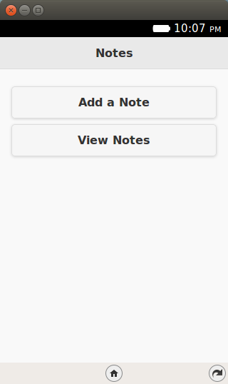

.. Copyright (C) Romin Irani. Permission is granted to copy, distribute
   and/or modify this document under the terms of the Creative Commons
   Attribution-ShareAlike 4.0 International Public License.

.. _storage:

Episode 6: Enabling Storage
===========================

Welcome to Episode 6 of the Firefox OS App Development Tutorial. This episode
will take you through the steps for writing Firefox OS Apps that add
persistence capability to your application. What this means is that you can use
a local database of sorts to save your data and the data will be available not
just across the application but also across application restarts.

Prerequisites
-------------

* You have setup your machine with the Firefox OS Simulator.  If not you can
  check out :ref:`dev_setup`, which takes you through the entire setup.
* You have install the ``zipcodeapp`` that we covered in :ref:`hello_world`.
  This tutorial uses that as an example, but if you have any other application
  installed in the Firefox WebIDE, then you should be able to follow along. But
  I strongly suggest getting the `zipcodeapp source code from Github
  <https://github.com/jelkner/zipcodeapp>`__, and installing it as discussed
  in the previous episode.

What this Episode covers 
------------------------

* What is the HTML5 LocalStorage API.
* Sample Firefox OS Application that covers using HTML5 LocalStorage API.

Episode 6 in Action
-------------------

Let us check out the application in action first. This will help you understand
what we shall be achieving by the end of this episode.

What we shall write is a mobile application that will allow us to save some
quick notes. Each note will have a title and some details. These notes will be
saved in the Local Storage of the device and then we can view all our notes
too.

All right then, the first screen of the mobile app is shown below:

When we click on the ``Add a Note`` button, we get a screen as shown below
where we can enter the title and details for the new note. Once we are done, we
can save the note by clicking on the ``Save Note`` button.

.. image:: illustrations/episode06/save_notes2.png
   :alt: SaveNotes app with first note being edited
   :height: 350px

If the note is successfully saved, it will display a message as shown below:

.. image:: illustrations/episode06/save_notes3.png
   :alt: SaveNotes app with first note saved 
   :height: 350px

To view all the notes, you need to click on the ``View Notes`` button from the
main screen. This will retrieve all the notes from the Local Storage and
display them to you in a collapsible list form.

.. image:: illustrations/episode06/save_notes4.png
   :alt: SaveNotes app with list of notes 
   :height: 350px

You can click on any of the ``+`` signs and it will expand to show you the note 
details as shown below:

.. image:: illustrations/episode06/save_notes5.png
   :alt: SaveNotes app with list with expanded 2nd note 
   :height: 350px

If you wish to delete all the notes, there is also a ``Clear`` button. This
will delete permanently all the notes from the Local Storage.

Let’s get going with the code. Note that the example screenshots are from the
Firefox OS Simulator running locally. So you can use your Firefox OS Simulator
to run all the examples.

Download Full Source Code – Episode 6
-------------------------------------

I suggest that you begin with a full download of the project source code.
Since the project depends on libraries like jQuery and jQuery Mobile, it will
save you the hassle of downloading the dependent libraries.

Go ahead & download the code from: https://github.com/jelkner/SaveNotes

Extract all the code in some directory. You should see a directory structure
inside of ``SaveNotes`` that looks something like this:

HTML5 Storage APIs
------------------

The HTML5 Storage API is a JavaScript API that will allow your application to
store data and retain that data even across browser restarts. 

As a first step to make web applications work offline, we need a storage API
that allows the application to store application specific data and use it as
needed. Here are some examples of how you could use storage:

* Games: You need to store the current moves in an application, so that if the
  user were to come later later to the application, you can replay back the
  moves. Save high scores maybe?
* Business Apps: How about saving information locally. E.g. taking offline
  orders, writing notes, etc. notes locally and looking them up.

You will easily be able to think of more use cases.

The Storage API also known as the Local Storage API provides a key based
storage with a simple API to go along with it. The amount of storage size
allocated per domain is anywhere from 5MB-10MB, which should be sufficient for
most applications. There is also another API available for storage (IndexedDB),
which provides a more sophisticated database like structure a la SQL, but we
shall keep the discussion limited now to simple storage support in the form of
key-based values.

Few things to do about the Storage API:

* The Local Storage Object that is provided to you is available under
  ``window.localStorage``. But for all purposes, you can use as
  ``localStorage``. All the methods for saving, removing, etc will be invoked
  in a format that looks like ``localStorage.<some-method>``.
* There are just 6 methods that you need to be familiar with to understand the
  localStorage API. If you have worked with maps or key-value data structures
  before in any language, it should be familiar.
* The methods are:
    * ``getItem(<key>)``: Returns back the value for the key.
    * ``setItem(<key>,<value>)``: Sets a value (Creates or overwrites) for a
      key.
    * ``removeItem(<key>)``: Deletes the entry for that particular key.
    * ``clear()``: removes all the entries in the Local Storage.
    * ``length``: returns a count of the number of keys in the local storage
    * ``key(<index>)``: returns the value for a key as per the index. The
      index ranges from 0 to (length-1)

SaveNotes Application
---------------------

OK. Lets get going with understand the code and how the Local Storage API has
been used to persist (save) notes in our application.

SaveNotes Application - ``manifest.webapp``
-------------------------------------------

The first thing we should discuss is the manifest file. This should be familiar
now and it has the standard attributes like name, version, etc. There is
nothing special happening here.

.. literalinclude:: _static/episode06/manifest.webapp
   :language: javascript 
   :linenos:

SaveNotes Application - ``index.html``
--------------------------------------

Next up is the ``index.html`` page and it is a simple jQuery Mobile page.

.. literalinclude:: _static/episode06/index.html
   :language: html 
   :linenos:

Let us discuss the ``index.html`` page in detail now:
