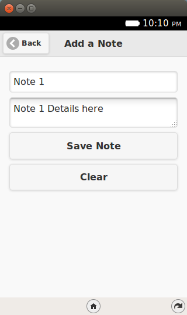
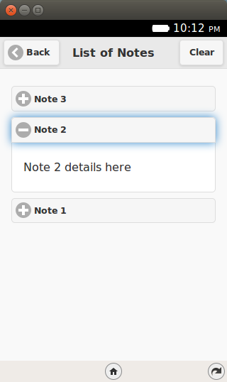

.. Copyright (C) Romin Irani. Permission is granted to copy, distribute
   and/or modify this document under the terms of the Creative Commons
   Attribution-ShareAlike 4.0 International Public License.

.. _indexedDB:

Episode 7: Storage using IndexedDB
==================================

Welcome to Episode 7 of the Firefox OS App Development Tutorial. In the
previous episode, we looked at how you could add persistence to your
application via the localStorage API. As the objects that you want to persist
become more complicated, you can use another HTML5 API called
`IndexedDB API <http://www.w3.org/TR/IndexedDB/>`__,
which lets you store complex objects. That's what this episode is about.

Prerequisites
-------------

* You have setup your machine with the Firefox OS Simulator.  If not you can
  check out :ref:`dev_setup`, which takes you through the entire setup.
* You have a basic understanding of writing Firefox OS Apps.  If not, I
  strongly suggest refering to earlier episodes, especially :ref:`hello_world`,
  that covers how to write your first Firefox OS App.

What this Episode covers 
------------------------

* What is the `HTML5 IndexedDB API <http://www.w3.org/TR/IndexedDB/>`__.
* Sample Firefox OS Application that covers using the HTML5 IndexedDB API. 
  We shall be extending the same Notes application that we wrote earlier. We
  will replace the localStorage API calls with the IndexedDB API calls in this
  episode.

Episode 7 in Action
-------------------

Let us check out the application in action first. The application is going to
be similar to the previous one and in terms of UI and functionality, there is
no difference.  But we will repeat it here for the sake of refreshing
everything again.

What we shall write is a mobile application that will allow us to save some
quick notes. Each note will have a title and some details. These notes will be
saved in the Indexed DB of the device and then we can view all our notes too.

All right then, the first screen of the mobile app is shown below:

.. image:: illustrations/episode06/save_notes1.png
   :alt: SaveNotes app on launch 
   :height: 350px

When we click on the ``Add a Note`` button, we get a screen as shown below
where we can enter the title and details for the new note. Once we are done, we
can save the note by clicking on the ``Save Note`` button.

If the note is successfully saved, it will display a message as shown below:

To view all the notes, you need to click on the ``View Notes`` button from the
main screen. This will retrieve all the notes from the Local Storage and
display them to you in a collapsible list form.

You can click on any of the ``+`` signs and it will expand to show you the note 
details as shown below:

If you wish to delete all the notes, there is also a ``Clear`` button. This
will delete permanently all the notes from the Local Storage.

Let’s get going with the code. Note that the example screenshots are from the
Firefox OS Simulator running locally. So you can use your Firefox OS Simulator
to run all the examples.

Download Full Source Code - Episode 7
-------------------------------------

